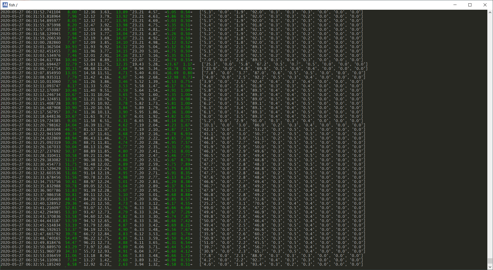

# cluster_monitor
connects to given IPs via SSH and uses information from `/proc` to display accumulated cpu, memory and network utilization

currently, that’s average, _min and ‾max percentage for cpu and memory as well as MiB/s →rx/tx→ during the last interval

